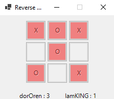

# Reverse TicTacToe
A Reverse TicTacToe project with 2 levels of difficulties based on game theory strategies- symmetry and MinMax.

I created this project using some of the knowledge I gained in:
- C#	
- WinForms
- Git & Github
- Game Theory

Thank you for your time 😁

